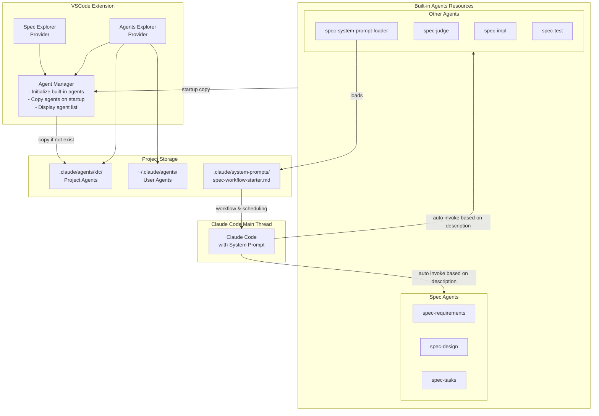

# Design Document

## Overview

This design document describes how to enhance the existing spec workflow process by introducing multiple specialized Claude Code subagents. The design will create three core subagents (spec-requirements, spec-design, spec-tasks) along with corresponding VSCode plugin integration to achieve parallel processing and specialized management.

## Architecture

### Overall Architecture



### Component Interactions

1. **Plugin Startup**: Check `.claude/agents/kfc/` directory on each startup, copy built-in agents if they don't exist
2. **Workflow Initialization**: spec-system-prompt-loader loads `.claude/system-prompts/spec-workflow-starter.md`, providing scheduling strategies and spec workflow system prompt to the main thread
3. **Agent Management**: Agent Manager is responsible for initializing and managing agents, but not for invoking them
4. **Subagent Invocation**: Claude Code main thread automatically identifies and invokes corresponding subagents based on scheduling strategies and agent descriptions in the system prompt
5. **UI Display**: Agents Explorer displays project-level and user-level agents, allowing users to view and edit

## Components and Interfaces

### 1. Agent Manager

```typescript
interface AgentManager {
  // Initialize built-in agents (copy to .claude/agents/kfc/ on startup)
  initializeBuiltInAgents(): Promise<void>;
  
  // Get agent list
  getAgentList(type: 'project' | 'user' | 'all'): Promise<AgentInfo[]>;
  
  // Check if agent exists
  checkAgentExists(agentName: string, location: 'project' | 'user'): boolean;
  
  // Get agent file path
  getAgentPath(agentName: string): string | null;
}

interface AgentInfo {
  name: string;
  description: string;
  path: string;
  type: 'project' | 'user';
  tools?: string[];
}
```

### 2. Agents Explorer Provider

```typescript
class AgentsExplorerProvider extends vscode.TreeDataProvider<AgentItem> {
  constructor(
    private context: vscode.ExtensionContext,
    private agentManager: AgentManager
  );
  
  // Get agent tree structure
  getChildren(element?: AgentItem): Promise<AgentItem[]>;
  
  // Refresh view
  refresh(): void;
  
  // Open agent file
  openAgentFile(agentPath: string): Promise<void>;
}

class AgentItem extends vscode.TreeItem {
  constructor(
    public readonly label: string,
    public readonly agentInfo: AgentInfo,
    public readonly collapsibleState: vscode.TreeItemCollapsibleState
  );
}
```

### 3. Built-in Agents Initialization Process

```typescript
class AgentInitializer {
  private readonly BUILT_IN_AGENTS = [
    'spec-requirements',
    'spec-design', 
    'spec-tasks',
    'spec-system-prompt-loader',
    'spec-judge',
    'spec-impl',
    'spec-test'
  ];
  
  async initializeOnStartup(): Promise<void> {
    const targetDir = path.join(workspaceRoot, '.claude/agents/kfc');
    
    for (const agentName of this.BUILT_IN_AGENTS) {
      const targetPath = path.join(targetDir, `${agentName}.md`);
      
      // Copy if file doesn't exist
      if (!fs.existsSync(targetPath)) {
        await this.copyBuiltInAgent(agentName, targetPath);
      }
    }
  }
  
  private async copyBuiltInAgent(agentName: string, targetPath: string): Promise<void> {
    const sourcePath = path.join(extensionPath, 'resources/agents', `${agentName}.md`);
    await fs.promises.copyFile(sourcePath, targetPath);
  }
}
```

### 4. Built-in Spec Subagents

The built-in spec subagents have been carefully designed and tested, including:

**Core Spec Agents:**
- **spec-requirements**: Specialized in creating and optimizing EARS format requirement documents
- **spec-design**: Creates detailed technical design solutions based on requirement documents
- **spec-tasks**: Converts designs into executable implementation task lists

**Supporting Agents:**
- **spec-system-prompt-loader**: Loads `.claude/system-prompts/spec-workflow-starter.md`, providing workflow and scheduling strategies to the main thread
- **spec-judge**: Reviews spec document quality
- **spec-impl**: Executes specific coding implementation tasks
- **spec-test**: Creates test documents and test code

These agents will be automatically copied to the project's `.claude/agents/kfc/` directory during plugin initialization. The loading of spec-system-prompt-loader enables the main thread to understand the entire spec workflow and automatically schedule based on agent descriptions.

## Data Models

### Agent Configuration File Structure

```typescript
interface AgentConfig {
  // YAML frontmatter
  name: string;
  description: string;
  tools?: string[];
  
  // Markdown body
  systemPrompt: string;
}
```

### Agent Storage Locations

- **Project-level agents**: `.claude/agents/kfc/*.md` (built-in agents copied here)
- **User-level agents**: `~/.claude/agents/*.md`
- **Built-in resources**: Extension resource directory `resources/agents/*.md`

## Error Handling

### 1. Agent Initialization Errors

- **Scenario**: Built-in agent copy failure
- **Handling**: Log error to output channel, skip the file, continue processing other agents

### 2. Agent File Edit Confirmation

- **Scenario**: User modifies agent file through Agents Explorer
- **Handling**:
  - Display confirmation dialog in screen center
  - Save changes after confirmation
  - Restore original content if cancelled

### 3. Agent File Missing

- **Scenario**: User deletes built-in agent file from project
- **Handling**:
  - Automatically restore on next startup
  - Provide manual restore option

## Testing Strategy

### 1. Unit Testing

- **AgentManager**: Test agent initialization, list retrieval, file operations
- **AgentsExplorerProvider**: Test tree structure generation, event handling
- **Subagent Coordination**: Test parameter passing, result handling

### 2. Integration Testing

- **End-to-end Workflow**: Test complete spec creation process
- **Parallel Execution**: Test multiple subagents working simultaneously
- **Error Recovery**: Test handling of various error scenarios

### 3. User Acceptance Testing

- **UI Interaction**: Verify Agents Explorer user experience
- **Performance Testing**: Ensure subagent calls don't block UI
- **Compatibility Testing**: Verify compatibility with existing spec workflow

## Implementation Considerations

1. **Backward Compatibility**: New subagent system should be compatible with existing spec workflow
2. **Performance Optimization**: Use caching mechanisms to reduce file system access
3. **User Experience**: Provide clear progress feedback and error prompts
4. **Security**: Limit subagent tool permissions to prevent misoperations
5. **Extensibility**: Design should support adding more types of subagents in the future
6. **Dual Entry Support**: Spec Explorer should support both original process and new subagent process entry points