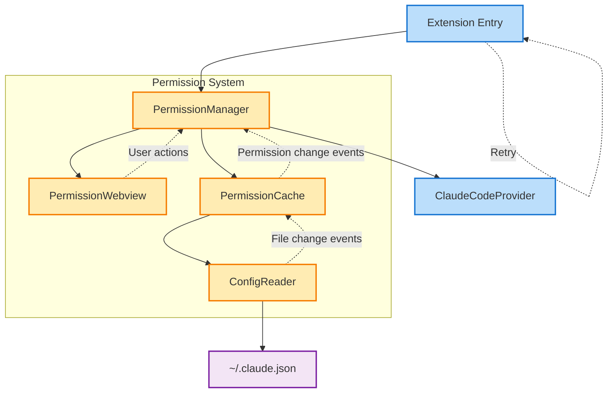
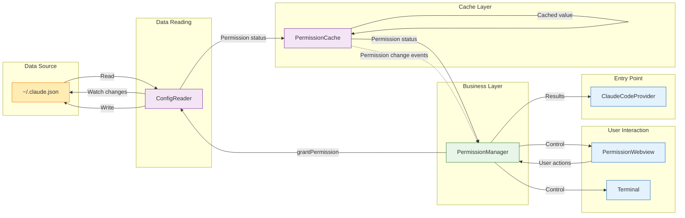
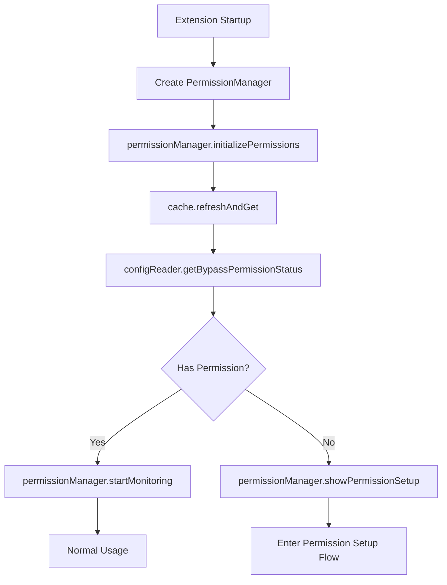
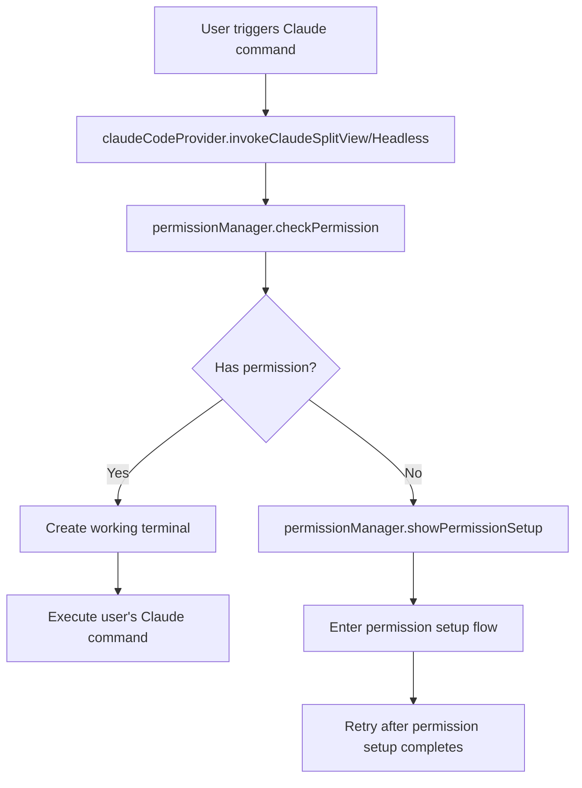
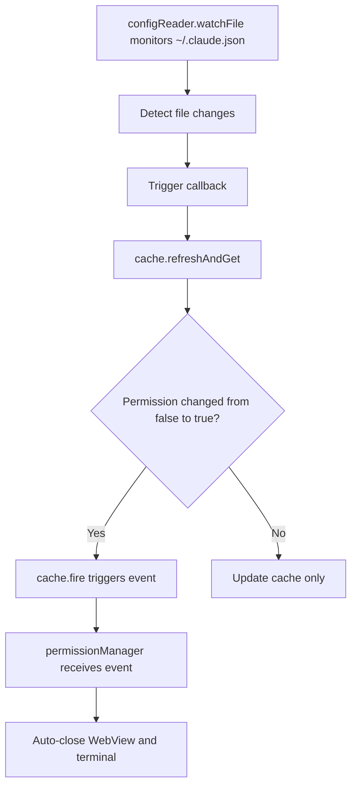
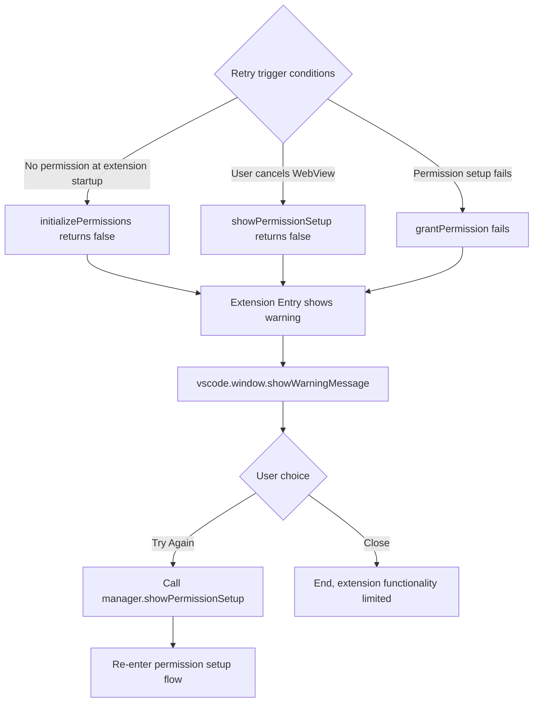

# Design Document

## Overview

This design document describes the enhancement plan for the Claude Code permission verification system. The existing system relies on user confirmation clicks in WebView but doesn't verify if permissions are actually granted. The new system will perform bidirectional verification by checking the `bypassPermissionsModeAccepted` field in the `~/.claude.json` configuration file to ensure permissions are truly granted.

## Existing System Analysis

### Current Implementation

- **Permission State Storage**: Uses `context.globalState` to store user-declared status
- **Initialization Flow**:
  1. Check globalState when extension starts
  2. If no permission record exists, create terminal to run `claude --permission-mode bypassPermissions`
  3. Display PermissionWebview to guide user
  4. Update globalState after user clicks "I have granted permissions" (but doesn't verify actual state)

### Existing Problems

1. Relies on honest user clicks without actual verification
2. Cannot detect when permissions are revoked
3. Lacks error handling and retry mechanisms

## Enhanced Architecture

### System Architecture Diagram



### Data Flow Diagram



### Core Component Design

#### 1. PermissionManager (Permission Manager)

- **Responsibilities**: Central coordinator for the Permission System, managing the entire permission flow
- **Location**: `src/features/permission/permissionManager.ts`
- **Key Functions**:
  - Check permission status when extension starts
  - Coordinate terminal creation and WebView display
  - Handle user operation results
  - Manage resource cleanup

```typescript
class PermissionManager {
  private permissionWebview?: vscode.WebviewPanel;
  private currentTerminal?: vscode.Terminal;
  private cache: IPermissionCache;
  private configReader: ConfigReader;
  
  constructor(
    private context: vscode.ExtensionContext,
    private outputChannel: vscode.OutputChannel
  ) {
    this.configReader = new ConfigReader(outputChannel);
    this.cache = new PermissionCache(this.configReader, outputChannel);
    
    // Listen to permission change events
    this.cache.event((hasPermission) => {
      if (hasPermission && this.permissionWebview) {
        this.permissionWebview.dispose();
        NotificationUtils.showAutoDismissNotification('✅ Permission verified!');
      }
    });
  }
  
  // Called when extension starts, initialize permission system
  async initializePermissions(): Promise<boolean>;
  
  // Runtime permission check (using cache)
  async checkPermission(): Promise<boolean>;
  
  // Called when WebView "I have granted permissions" is clicked
  async grantPermission(): Promise<boolean>;
  
  // Show permission setup flow (can be called during extension startup and runtime)
  async showPermissionSetup(): Promise<boolean>;
  
  startMonitoring(): void;
  dispose(): void;
}
```

#### 2. PermissionCache (Permission Cache)

- **Responsibilities**: Manage in-memory cache of permission status, optimize performance
- **Location**: `src/features/permission/permissionCache.ts`
- **Key Functions**:
  - Cache permission status to avoid frequent file reads
  - Send permission change events
  - Cache never expires unless file changes

```typescript
interface IPermissionCache {
  get(): Promise<boolean>;
  refresh(): Promise<void>;
  refreshAndGet(): Promise<boolean>;
  readonly event: vscode.Event<boolean>;
}

class PermissionCache extends vscode.EventEmitter<boolean> implements IPermissionCache {
  private cache?: boolean;
  
  constructor(
    private configReader: ConfigReader,
    private outputChannel: vscode.OutputChannel
  ) {
    super();
  }
  
  async get(): Promise<boolean> {
    if (this.cache !== undefined) {
      return this.cache;
    }
    return this.refreshAndGet();
  }
  
  async refresh(): Promise<void> {
    await this.refreshAndGet();
  }
  
  async refreshAndGet(): Promise<boolean> {
    const oldValue = this.cache;
    this.cache = await this.configReader.getBypassPermissionStatus();
    
    // Trigger event when permission changes from false to true
    if (oldValue === false && this.cache === true) {
      this.fire(true);
    }
    
    return this.cache;
  }
}
```

#### 3. ConfigReader (Configuration Reader)

- **Responsibilities**: Handle all operations on `~/.claude.json` file
- **Location**: `src/features/permission/configReader.ts`
- **Key Functions**:
  - Read configuration file
  - Write permission settings
  - Monitor file changes

```typescript
class ConfigReader {
  private configPath = path.join(os.homedir(), '.claude.json');
  
  constructor(private outputChannel: vscode.OutputChannel) {}
  
  async getBypassPermissionStatus(): Promise<boolean> {
    try {
      if (!fs.existsSync(this.configPath)) {
        return false;
      }
      const content = await fs.promises.readFile(this.configPath, 'utf8');
      const config = JSON.parse(content);
      return config.bypassPermissionsModeAccepted === true;
    } catch (error) {
      this.outputChannel.appendLine(`[ConfigReader] Error: ${error}`);
      return false;
    }
  }
  
  async setBypassPermission(value: boolean): Promise<void>;
  watchConfigFile(callback: () => void): void;
  dispose(): void;
}
```

#### 4. PermissionWebview (Permission Setup Interface)

- **Responsibilities**: Provide user interface, collect user operations
- **Location**: `src/webview/permissionWebview.ts` (existing component)
- **Change Description**: Only minor adjustments needed, mainly adding PermissionManager parameter
- **Enhanced Features**:
  - Receive PermissionManager instance
  - Handle user operations through Manager
  - Don't directly manipulate files or state

```typescript
export class PermissionWebviewProvider {
  public static currentPanel: vscode.WebviewPanel | undefined;
  
  public static createOrShow(
    context: vscode.ExtensionContext,
    permissionManager?: PermissionManager  // New parameter
  ): Promise<boolean> {
    // Existing code remains mostly unchanged
    // Only call permissionManager.grantPermission() when handling 'accept' messages
  }
}
```

#### 5. Integration Plan Description

Based on existing code, the retry mechanism is already implemented at the Extension Entry layer through simple recursive calls. The new Permission System will maintain this simple retry approach:

```typescript
// Retry logic in Extension Entry
async function initializeExtension(context: vscode.ExtensionContext) {
  const permissionManager = new PermissionManager(context, outputChannel);
  
  const hasPermission = await permissionManager.initializePermissions();
  
  if (!hasPermission) {
    // Show warning and provide retry option
    vscode.window.showWarningMessage(
      'Claude Code permissions not granted. Some features may not work properly.',
      'Try Again'
    ).then(async selection => {
      if (selection === 'Try Again') {
        // Directly call permission setup flow instead of recursion
        await permissionManager.showPermissionSetup();
      }
    });
  }
  
  // Save manager for use elsewhere
  context.workspaceState.update('permissionManager', permissionManager);
}
```

This design maintains the existing simplicity without needing additional RetryHandler components.

#### 6. ClaudeCodeProvider (Enhanced Existing Component)

- **Responsibilities**: Provide terminal creation services
- **Location**: `src/providers/claudeCodeProvider.ts` (existing component)
- **Change Description**: Only need to add one static method, existing code remains unchanged
- **New Method**:

```typescript
class ClaudeCodeProvider {
  // Existing code remains unchanged...
  
  // Only add this method
  static createPermissionTerminal(): vscode.Terminal {
    const workspaceFolder = vscode.workspace.workspaceFolders?.[0]?.uri.fsPath;
    const terminal = vscode.window.createTerminal({
      name: 'Claude Code - Permission Setup',
      cwd: workspaceFolder,
      location: { viewColumn: vscode.ViewColumn.Two }
    });
    
    terminal.show();
    terminal.sendText(
      'claude --permission-mode bypassPermissions "Setting up Claude Code permissions..."',
      true
    );
    
    return terminal;
  }
}
```

### Data Models

```typescript
// Claude configuration file structure
interface ClaudeConfig {
  bypassPermissionsModeAccepted?: boolean;
  // Other configuration items...
}

// WebView messages
interface PermissionWebviewMessage {
  command: 'accept' | 'cancel';
  data?: any;
}

// WebView status update messages
interface WebviewStatusMessage {
  command: 'updateStatus';
  status: 'verifying' | 'failed' | 'success';
  message?: string;
}

// File change event data
interface FileChangeEvent {
  configPath: string;
  previousMtime: Date;
  currentMtime: Date;
}
```

## Business Process

### 1. Permission Check During Extension Startup



### 2. Permission Setup Flow

```mermaid
graph TD
    A[permissionManager.showPermissionSetup] --> B[claudeCodeProvider.createPermissionTerminal]
    B --> C[terminal.show]
    C --> D[terminal.sendText: claude --permission-mode bypassPermissions]
    A --> E[permissionWebview.createOrShow]
    E --> F[Show permission setup interface]
    F --> G{User operation}
    
    %% Path 1: Terminal operation
    G -->|Terminal selects Yes| H[Claude CLI updates file]
    H --> I[configReader.watchFile detects changes]
    I --> J[cache.refresh]
    J --> K[cache.event triggers permission change]
    K --> L[permissionManager listens to event]
    L --> M[webview.dispose]
    L --> N[terminal.dispose]
    
    %% Path 2: WebView operation
    G -->|Click "I have granted permissions"| O[permissionManager.grantPermission]
    O --> P[configReader.setBypassPermission]
    P --> Q[cache.refreshAndGet]
    Q --> R[webview.dispose]
    Q --> S[terminal.dispose]
    
    %% Path 3: User cancellation
    G -->|Cancel| T[webview returns false]
    T --> U[terminal.dispose]
    U --> V[Show retry option]
```

### 3. Permission Check During Claude Command Execution



### 4. File Monitoring Mechanism



### 5. Retry Flow



**Specific retry scenarios**:

1. **No permission detected at extension startup**
   - `initializePermissions()` returns false
   - User cancels during permission setup flow

2. **User clicks cancel in WebView**
   - `showPermissionSetup()` returns false
   - User closes the permission setup window

3. **Permission setup fails**
   - User clicks "I have granted permissions" but verification fails
   - File write failures or other exceptional situations

4. **Scenarios that won't trigger retry**
   - Runtime permission check failure (`checkPermission()` returns false)
   - This case directly calls `showPermissionSetup()`, bypassing retry flow

## Integration Plan

### 1. Simplified ClaudeCodeProvider

```typescript
export class ClaudeCodeProvider {
  private static permissionManager?: PermissionManager;
  
  static async initializePermissions(
    context: vscode.ExtensionContext, 
    outputChannel?: vscode.OutputChannel
  ): Promise<void> {
    // Create permission manager
    this.permissionManager = new PermissionManager(context, outputChannel);
    
    // Check actual file status directly, not relying on globalState
    const hasValidPermission = await this.permissionManager.initializePermissions();
    
    if (!hasValidPermission) {
      // Call PermissionManager to handle permission setup
      const userAccepted = await this.permissionManager.showPermissionSetup();
      
      if (userAccepted) {
        outputChannel?.appendLine('[ClaudeCodeProvider] Permission setup completed successfully');
        NotificationUtils.showAutoDismissNotification('✅ Claude Code permissions setup completed successfully!');
      } else {
        outputChannel?.appendLine('[ClaudeCodeProvider] User cancelled permission setup');
        
        const retry = await vscode.window.showWarningMessage(
          'Claude Code needs permissions to function properly.',
          'Try Again',
          'Cancel'
        );
        
        if (retry === 'Try Again') {
          // Recursive call to restart
          await ClaudeCodeProvider.initializePermissions(context, outputChannel);
        }
      }
    } else {
      outputChannel?.appendLine(
        '[ClaudeCodeProvider] Permission already granted (verified from ~/.claude.json)'
      );
    }
    
    // Start file monitoring
    this.permissionManager.startMonitoring();
  }
  
  async invokeClaudeSplitView(prompt: string, options?: InvokeOptions) {
    // Check permission (using cache)
    if (!await this.permissionManager.checkPermission()) {
      const granted = await this.permissionManager.showPermissionSetup();
      if (!granted) return;
    }
    
    // Continue with existing logic
    // ...
  }
}
```

### 2. Simplified PermissionWebview

```typescript
export class PermissionWebviewProvider {
  private static verificationInProgress = false;
  
  public static createOrShow(
    context: vscode.ExtensionContext,
    permissionManager?: PermissionManager
  ): Promise<boolean> {
    // ... existing code ...
    
    // Enhanced message handling
    panel.webview.onDidReceiveMessage(async message => {
      switch (message.command) {
        case 'accept':
          // Trigger verification
          if (permissionManager) {
            this.verificationInProgress = true;
            panel.webview.postMessage({ 
              command: 'updateStatus', 
              status: 'verifying' 
            });
            
            const isValid = await permissionManager.verifyAndUpdatePermission();
            
            if (isValid) {
              panel.dispose();
              resolve(true);
            } else {
              panel.webview.postMessage({ 
                command: 'updateStatus', 
                status: 'failed',
                message: 'Permission not detected, please ensure you selected "Yes" in the terminal'
              });
            }
            this.verificationInProgress = false;
          }
          break;
        // ... other handling ...
      }
    });
  }
}
```

## Implementation Details

### Event-Driven Permission Changes

```typescript
// 1. PermissionCache triggers events
class PermissionCache extends vscode.EventEmitter<boolean> implements IPermissionCache {
  private cache?: boolean;
  
  async refresh(): Promise<boolean> {
    const oldValue = this.cache;
    this.cache = await this.configReader.getBypassPermissionStatus();
    
    // If permission changes from false to true, trigger event
    if (oldValue === false && this.cache === true) {
      this.fire(true);
    }
    
    return this.cache;
  }
}

// 2. PermissionManager listens to permission changes
class PermissionManager {
  private permissionWebview?: vscode.WebviewPanel;
  private currentTerminal?: vscode.Terminal;
  
  constructor(/* ... */) {
    // Listen to permission change events
    this.cache.event((hasPermission) => {
      if (hasPermission && this.permissionWebview) {
        // Auto-close WebView
        this.permissionWebview.dispose();
        this.permissionWebview = undefined;
        
        // Show success notification
        NotificationUtils.showAutoDismissNotification(
          '✅ Claude Code permissions detected and verified!'
        );
      }
    });
  }
  
  async showPermissionSetup(): Promise<boolean> {
    try {
      // Create terminal
      const workspaceFolder = vscode.workspace.workspaceFolders?.[0]?.uri.fsPath;
      this.currentTerminal = vscode.window.createTerminal({
        name: 'Claude Code - Permission Setup',
        cwd: workspaceFolder,
        location: { viewColumn: vscode.ViewColumn.Two }
      });
      
      this.currentTerminal.show();
      this.currentTerminal.sendText(
        'claude --permission-mode bypassPermissions "Setting up Claude Code permissions..."',
        true
      );
      
      // Create WebView and save reference
      const result = await PermissionWebviewProvider.createOrShow(
        this.context,
        this  // Pass PermissionManager instance
      );
      
      // Save WebView reference for event-driven closure
      this.permissionWebview = PermissionWebviewProvider.currentPanel;
      
      return result;
    } finally {
      // Clean up terminal
      if (this.currentTerminal) {
        this.currentTerminal.dispose();
        this.currentTerminal = undefined;
      }
    }
  }
  
  startMonitoring(): void {
    // File monitoring
    this.configReader.watchConfigFile(async () => {
      await this.cache.refresh();
    });
  }
}

// 3. WebView modifies file through PermissionManager
class PermissionWebviewProvider {
  public static createOrShow(
    context: vscode.ExtensionContext,
    permissionManager?: PermissionManager
  ): Promise<boolean> {
    // ... existing code ...
    
    panel.webview.onDidReceiveMessage(async message => {
      switch (message.command) {
        case 'accept':
          // User clicks "I have granted permissions"
          if (permissionManager) {
            try {
              // Grant permission through PermissionManager
              const success = await permissionManager.grantPermission();
              
              if (success) {
                // Close WebView
                panel.dispose();
                resolve(true);
              } else {
                // Show error
                panel.webview.postMessage({ 
                  command: 'updateStatus', 
                  status: 'failed',
                  message: 'Unable to set permission, please retry'
                });
              }
            } catch (error) {
              // Show error
              panel.webview.postMessage({ 
                command: 'updateStatus', 
                status: 'failed',
                message: `Permission setup failed: ${error.message}`
              });
            }
          } else {
            // If no permissionManager, fall back to original logic
            panel.dispose();
            resolve(true);
          }
          break;
        // ... other handling ...
      }
    });
  }
}

// 4. PermissionManager implements grantPermission
class PermissionManager {
  async grantPermission(): Promise<boolean> {
    try {
      // Call ConfigReader to set permission
      await this.configReader.setBypassPermission(true);
      
      // Refresh cache
      await this.cache.refresh();
      
      // Log activity
      this.outputChannel.appendLine(
        '[PermissionManager] Permission granted via WebView'
      );
      
      return true;
    } catch (error) {
      this.outputChannel.appendLine(
        `[PermissionManager] Failed to grant permission: ${error}`
      );
      return false;
    }
  }
}
```

### Permission Verification Flow

```typescript
class PermissionManager {
  async verifyAndUpdatePermission(): Promise<boolean> {
    try {
      // 1. Give user time to complete terminal operation
      await new Promise(resolve => setTimeout(resolve, 2000));
      
      // 2. Verify permission
      const result = await this.verifier.verify();
      
      if (result.hasPermission) {
        // 3. Clear memory cache, force reading latest state next time
        this.invalidateCache();
        
        // 4. Log success
        this.outputChannel.appendLine(
          '[PermissionManager] Permission verified successfully'
        );
        
        return true;
      }
      
      // 5. If failed, provide detailed information
      this.outputChannel.appendLine(
        `[PermissionManager] Permission verification failed: ${JSON.stringify(result)}`
      );
      
      return false;
    } catch (error) {
      this.outputChannel.appendLine(`[PermissionManager] Verification error: ${error}`);
      return false;
    }
  }
}
```

### File Operation Implementation

```typescript
class ConfigReader {
  private fileWatchInterval?: NodeJS.Timer;
  
  async setBypassPermission(value: boolean): Promise<void> {
    try {
      // Read existing configuration
      let config: any = {};
      if (fs.existsSync(this.configPath)) {
        const content = await fs.promises.readFile(this.configPath, 'utf8');
        try {
          config = JSON.parse(content);
        } catch (e) {
          // If parsing fails, create new configuration
          config = {};
        }
      }
      
      // Set permission field
      config.bypassPermissionsModeAccepted = value;
      
      // Ensure directory exists
      const dir = path.dirname(this.configPath);
      if (!fs.existsSync(dir)) {
        await fs.promises.mkdir(dir, { recursive: true });
      }
      
      // Write back to file
      await fs.promises.writeFile(
        this.configPath,
        JSON.stringify(config, null, 2),
        'utf8'
      );
      
      this.outputChannel.appendLine(
        `[ConfigReader] Set bypassPermissionsModeAccepted to ${value}`
      );
    } catch (error) {
      this.outputChannel.appendLine(
        `[ConfigReader] Failed to set permission: ${error}`
      );
      throw error;
    }
  }
  
  watchConfigFile(callback: () => void): void {
    // Use Node.js fs.watchFile
    // Testing proves this is the most reliable method
    fs.watchFile(this.configPath, { interval: 2000 }, (curr, prev) => {
      if (curr.mtime.getTime() !== prev.mtime.getTime()) {
        this.outputChannel.appendLine(
          `[ConfigReader] Detected change in ~/.claude.json`
        );
        callback();
      }
    });
  }
  
  dispose(): void {
    // Stop monitoring
    fs.unwatchFile(this.configPath);
  }
}
```

## Error Handling

### Error Scenarios

1. **Configuration file does not exist**: Guide user to initialize Claude CLI
2. **Permission field is false**: Show detailed authorization steps
3. **File read failure**: Check file permissions
4. **JSON parsing error**: Indicate file corruption, suggest re-initialization

### User-Friendly Error Messages

```typescript
function getErrorMessage(result: PermissionCheckResult): string {
  if (!result.configExists) {
    return 'Claude configuration file not found. Please run "claude" command in terminal first to initialize.';
  }
  
  if (!result.fieldExists) {
    return 'Claude configuration file missing permission field. Please re-run permission setup flow.';
  }
  
  if (result.fieldValue === false) {
    return 'Permission not granted. Please run Claude command in terminal and select "Yes, I accept".';
  }
  
  if (result.error) {
    return `Configuration file read error: ${result.error}`;
  }
  
  return 'Unknown error, please check output logs.';
}
```

## Performance Optimization

1. **Caching Strategy**
   - Permission status cached for 5 minutes
   - Immediate invalidation on file changes
   - Immediate refresh after user operations

2. **Asynchronous Processing**
   - Permission checks don't block command execution
   - Use Promise for all I/O operations
   - Support timeout and cancellation

3. **Resource Management**
   - Proper cleanup of file watchers
   - Limit retry attempts
   - Reasonable polling intervals

## State Management Strategy

### Not Using globalState as Cache

Since the `~/.claude.json` file may be manually modified at any time (user editing, other tool modifications, etc.), we:

1. **Remove globalState dependency**: No longer rely on `kiroForClaudeCode.hasRunInitialPermission` as permission state
2. **Use memory cache only**: Short-term caching (like 30 seconds) to optimize performance
3. **Real-time verification**: Always verify actual file state during critical operations

### Caching Strategy

#### Cache Interface Design

```typescript
interface IPermissionCache {
  // Get permission status (first call reads file and caches, subsequent calls return cache)
  get(): Promise<boolean>;
  
  // Read file and update cache (called when file changes or forced verification needed)
  refresh(): Promise<boolean>;
}

class PermissionCache implements IPermissionCache {
  private cache?: boolean;
  
  constructor(
    private configReader: ConfigReader,
    private outputChannel: vscode.OutputChannel
  ) {}
  
  async get(): Promise<boolean> {
    // If cached, return directly
    if (this.cache !== undefined) {
      return this.cache;
    }
    
    // First call, read file and cache
    this.cache = await this.configReader.getBypassPermissionStatus();
    
    this.outputChannel.appendLine(
      `[PermissionCache] Initial load: ${this.cache}`
    );
    
    return this.cache;
  }
  
  async refresh(): Promise<boolean> {
    // Read latest state and update cache
    this.cache = await this.configReader.getBypassPermissionStatus();
    
    this.outputChannel.appendLine(
      `[PermissionCache] Refreshed: ${this.cache}`
    );
    
    return this.cache;
  }
}
```

#### PermissionManager Using Cache

```typescript
class PermissionManager {
  private cache: IPermissionCache;
  
  constructor(/* ... */) {
    this.cache = new PermissionCache(this.configReader, this.outputChannel);
  }
  
  // Refresh and check permission (used at extension startup)
  async refreshAndCheckPermission(): Promise<boolean> {
    return this.cache.refresh();
  }
  
  // Daily permission check: use cache
  async checkPermission(): Promise<boolean> {
    return this.cache.get();
  }
  
  // Verify user authorization (for permission setup flow)
  async verifyAndUpdatePermission(): Promise<boolean> {
    await new Promise(resolve => setTimeout(resolve, 2000));
    return this.cache.refresh();
  }
  
  // Update cache when file changes
  async onFileChanged(): Promise<void> {
    await this.cache.refresh();
  }
}

## Testing Plan

1. **Unit Tests**
   - Mock file system operations
   - Test various permission states
   - Verify cache logic

2. **Integration Tests**
   - Complete permission flow
   - WebView interactions
   - Error recovery

3. **Manual Testing Scenarios**
   - First installation
   - Recovery after permission revocation
   - Corrupted file handling
