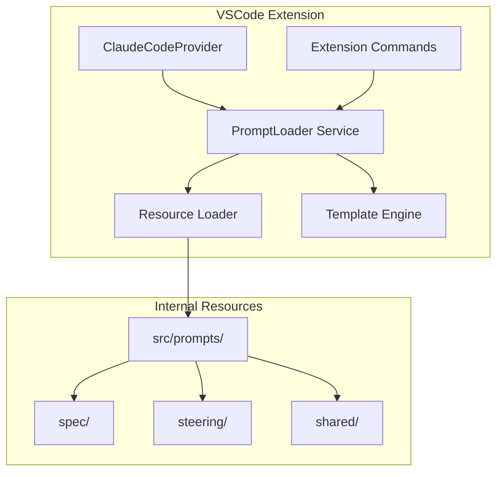

# Design Document

## Overview

This design proposal aims to separate hard-coded prompt templates in the Kiro for CC extension into independent Markdown files for management as internal resources. By establishing standardized prompt file structure and loading mechanisms, we improve code maintainability and development efficiency.

## Architecture

### System Architecture Diagram



### Core Design Principles

1. **All-in-One**: Directly replace all hard-coded prompts without maintaining fallback logic
2. **Simple and Direct**: Reduce intermediate layers, lower complexity
3. **Developer-Friendly**: Provide convenient development tools and debugging features
4. **Performance-First**: Use caching mechanisms to avoid frequent file I/O

## Components and Interfaces

### 1. Prompt File Format

Using Markdown + Frontmatter format to achieve elegant separation of configuration and content:

```markdown
<!-- src/prompts/spec/agent-system.md -->
---
id: spec-agent-system
name: Spec Agent System Prompt
version: 1.0.0
description: System prompt for spec agent workflow
variables:
  specsPath:
    type: string
    required: true
    description: Base path for specs
---

# System Prompt - Spec Agent

## Goal

You are an agent that specializes in working with Specs in Claude Code.
Specs base path: {{specsPath}}

## Workflow to execute

...
```

**Advantages**:

- Prompt content uses natural Markdown format, no escaping required
- Frontmatter stores metadata with clear structure
- VSCode native support for syntax highlighting and preview
- Git version control friendly

### 2. PromptLoader Service

Core service responsible for loading, parsing, and rendering prompts:

**Implementation Key Points**:

- Use build scripts to compile .md files into TypeScript modules
- Use `gray-matter` library to parse Markdown frontmatter
- Use Handlebars template engine for variable substitution
- Pre-compile all templates at startup and store in memory

```typescript
interface PromptLoader {
  // Load internal prompt resources
  loadPrompt(promptId: string): PromptTemplate;
  
  // Render prompt with variable substitution
  renderPrompt(promptId: string, variables: Record<string, any>): string;
  
  // Get all available prompts
  listPrompts(): PromptMetadata[];
  
  // Pre-load all prompts (called during initialization)
  initialize(): void;
}

interface PromptTemplate {
  id: string;
  name: string;
  version: string;
  description?: string;
  variables?: VariableDefinition[];
  template: string;
}
```

### 3. Prompt Export Interface

Directly replace existing hard-coded implementations:

```typescript
// Modify existing prompt files
export function getSpecAgentSystemPrompt(specsPath: string): string {
  const loader = PromptLoader.getInstance();
  return loader.renderPrompt('spec-agent-system', { specsPath });
}

// Maintain interface compatibility, only change internal implementation
export const SPEC_REFINE_PROMPTS = {
  requirements: (content: string) => 
    loader.renderPrompt('spec-requirements-refine', { content }),
  design: (content: string) => 
    loader.renderPrompt('spec-design-refine', { content }),
  tasks: (content: string) => 
    loader.renderPrompt('spec-tasks-refine', { content })
};
```

## Data Models

### Directory Structure

```plain
src/
├── prompts/           # Prompt resource files
│   ├── spec/
│   │   ├── agent-system.md
│   │   ├── requirements-refine.md
│   │   ├── design-refine.md
│   │   └── tasks-refine.md
│   ├── steering/
│   │   ├── system.md
│   │   ├── initial-product.md
│   │   ├── initial-structure.md
│   │   └── refine.md
│   └── shared/
│       └── common-templates.md
├── services/          # Service layer
│   └── promptLoader.ts
└── types/
    └── prompt.types.ts
```

### Prompt Frontmatter Schema

```typescript
interface PromptFrontmatter {
  // Required fields
  id: string;              // Unique identifier, use kebab-case
  name: string;            // Display name
  version: string;         // Semantic version number (x.y.z)
  
  // Optional fields
  description?: string;    // Description
  author?: string;         // Author
  tags?: string[];         // Tags for categorization and search
  extends?: string;        // ID of another prompt to inherit from
  
  // Variable definitions
  variables?: {
    [key: string]: {
      type: 'string' | 'number' | 'boolean' | 'array' | 'object';
      required?: boolean;
      default?: any;
      description?: string;
    }
  };
}
```

**Example File**:

```markdown
---
id: spec-requirements-refine
name: Requirements Refinement Prompt
version: 1.0.0
description: Refines requirements document based on user feedback
tags: [spec, requirements, refinement]
variables:
  requirements:
    type: string
    required: true
    description: Current requirements document content
  feedback:
    type: string
    required: true
    description: User feedback to incorporate
---

# Requirements Refinement

Based on the following requirements document:

{{requirements}}

User feedback:
{{feedback}}

Please refine the requirements document...
```

## Error Handling

### Error Types and Handling Strategies

1. **Resource Not Found**
   - Build failure during development with missing file prompts
   - Throw clear error messages at runtime
   - List all available prompt IDs

2. **Syntax Errors**
   - Real-time prompts during editing
   - Block and display errors on save
   - Provide fix suggestions

3. **Missing Variables**
   - Use default values (if defined)
   - Throw clear error messages
   - List all required variables

4. **Version Incompatibility**
   - Check schema version
   - Provide migration guidance
   - Maintain backward compatibility

## Testing Strategy

### Unit Testing

1. **PromptLoader Testing**
   - Loading valid/invalid files
   - Variable substitution logic
   - Caching mechanism
   - Error handling

2. **Template Engine Testing**
   - Variable substitution
   - Conditional logic
   - Loop structures
   - Escape handling

### Integration Testing

1. **End-to-End Workflow**
   - Create new prompt
   - Edit and save
   - Use in Claude Code
   - Verify correct output

2. **Migration Verification**
   - Ensure all prompts are converted to files
   - Verify functional consistency
   - Performance comparison testing

### Manual Testing

1. **Development Experience**
   - Editor functionality
   - Error prompts
   - Auto-completion
   - Quick actions

2. **User Scenarios**
   - Spec creation flow
   - Steering document generation
   - Prompt debugging

## Implementation Details

### Technology Choices

1. **Frontmatter Parsing**: Use `gray-matter` library
2. **Template Engine**: Use `handlebars` for variable substitution
3. **Resource Loading**: Use build scripts to convert .md files to TypeScript modules at compile time
4. **Caching Strategy**: Pre-load all templates to memory at startup
5. **Markdown Processing**: Use raw content directly, no additional parsing needed

### Performance Optimization

1. **Pre-loading**: Load all prompts when extension activates
2. **Pre-compilation**: Handlebars templates compiled at initialization
3. **Memory Caching**: All templates resident in memory
4. **Synchronous Access**: No async I/O needed, improved response speed

### Security Considerations

1. **Internal Resources**: Prompt files packaged within extension, users cannot modify
2. **Template Injection**: Escape user input variables
3. **Type Safety**: TypeScript type definitions ensure correct parameters
4. **Build-time Validation**: Validate all prompt file formats during packaging

## Task Implementation Context Design

> **Note**: This section serves as a design supplement memo, recording future implementation ideas, not implemented in the current prompt-separation feature.

### Overview

When executing specific tasks in specs, comprehensive context information needs to be provided to Claude Code. This includes:

1. **Steering Documents**: Project-level guidance principles and conventions
2. **Spec Documents**: Specific feature requirements, design, and task lists

### Context Loading Strategy

```typescript
interface TaskContext {
  // Steering document content
  steeringDocuments: SteeringDocument[];
  
  // All documents of current spec
  spec: {
    requirements: string;
    design: string;
    tasks: string;
    currentTask: TaskInfo;
  };
}

interface SteeringDocument {
  name: string;
  content: string;
  // Can be extended to include priority, scope and other metadata
}
```

### Implementation Approach

1. **Context Collector**
   - Automatically collect all relevant steering documents before task execution
   - Load complete documents of current spec (requirements, design, tasks)
   - Identify specific task to execute

2. **Prompt Construction**
   - Organize collected context by priority
   - Steering documents as global guidance
   - Spec documents as specific feature context
   - Current task as execution focus

3. **Example Prompt Structure**

   ```markdown
   <system>
   # Project Steering Context
   
   {{#each steeringDocuments}}
   ## {{name}}
   {{content}}
   {{/each}}
   </system>
   
   # Feature Specification
   
   ## Requirements
   {{spec.requirements}}
   
   ## Design
   {{spec.design}}
   
   ## Current Task
   From the task list, implement the following:
   {{spec.currentTask.description}}
   
   Task details:
   {{spec.currentTask.details}}
   ```

### Integration Points

1. **Task Execution Commands**
   - Modify `kfc.task.implement` command
   - Automatically load context before calling Claude Code

2. **ClaudeCodeProvider**
   - Add `executeTaskWithContext` method
   - Responsible for collecting and organizing context

3. **SpecManager**
   - Provide methods to get complete spec documents
   - Support task location and extraction

### Advantages

1. **Complete Context**: Claude Code can understand project conventions and specific requirements
2. **Consistency**: Ensure implementation conforms to project standards and design plans
3. **Automation**: No need to manually copy and paste document content
4. **Extensible**: Can add more context sources in the future (such as related code, tests, etc.)
